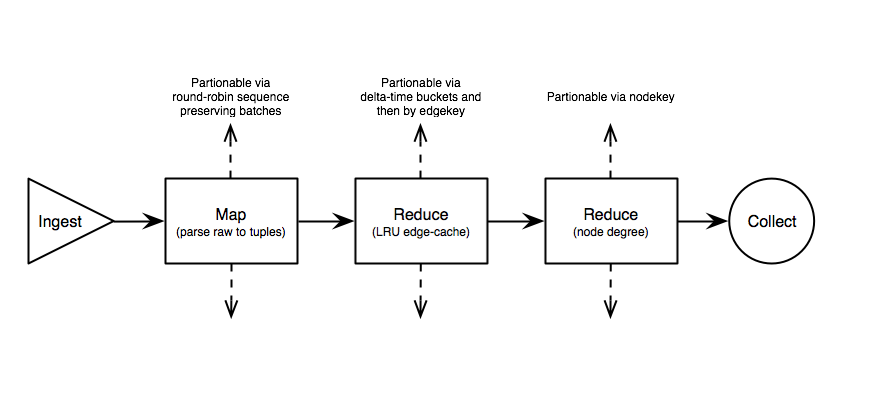

Code Challenge - Rolling Median Vertex Degree
=================

# Table of Contents

1. [Challenge Summary] (README.md#original-challenge-summary)
2. [Install Requirements](README.md#install-requirements)
3. [Details of Solution](README.md#details-of-solution)  
3.1 [Directory Structure](README.md#directory-structure)  
3.2 [Building the Graph](README.md#building-the-graph-map)   
3.3 [Maintaining data within the 60 Second Window](README.md#maintaining-data-within-the-60-second-window-reduce)  
3.3.1 [Rolling Window Cache](README.md#rolling-window-cache)  
3.3.2 [Ensuring unique edges](README.md#ensuring-unique-edges-within-the-window)  
3.3.3 [Dealing with edges out-of-sequence](README.md#dealing-with-edges-which-arrive-out-of-sequence)  
4. [Solution test suite](README.md#solution-test-suite)
5. [Benchmarks](README.md#benchmarks)
6. [Trade Offs and Future Improvement](README.md#trade-offs-and-future-improvement)
6.1 [Scaling](README.md#scaling)  
6.1.1 [Verical](README.md#vertical-implementation)  
6.1.1 [Horizontal](README.md#horizontal-distribution)  

> Develop a pipeline to compute the median vertex degree in a 60sec lagging window of a streaming real-time venmo transaction graph.

## Original Challenge Summary
[Back to Table of Contents] (README.md#table-of-contents)

Calculate the median vertex-degree of a transaction-graph while updating each time a new Venmo payment appears. You will be calculating the median degree across a 60-second sliding window.

The vertices on the graph represent Venmo users and whenever one user pays another user, an edge is formed between the two users.

## Install requirements
[Back to Table of Contents](README.md#table-of-contents)

| Dependency             | Version |
|------------------------|-------- |
|Python                  | 2.7.11  |
|blist                   | 1.3.6   |
|coloredlogs             | 5.0     |
|ujson                   | 1.35    |
|**Optional Depenedcies**| ------- |
|virtualenv              | 1.7.1.2 |
|pip                     | 1.1     |

All dependencies for this solution can be installed using the included `pip freeze` file in the repo root via the command 

	pip install -r freeze.txt

I recommended isolating the install in a vm, container, or virtualenv.

## Details of Solution
[Back to Table of Contents](README.md#table-of-contents)

This solution applies a **MapReduce** pattern to a linear-flow topology. Data is **ingested** from a file simulating a real-time stream. The input is then **mapped** into a tuple representation of transaction-edges belonging to the payment graph. Output from the mapping step is fed into an "**edge-reducer**" which maintains a **rolling hash-map** functioning as a **least-recently-used cache**. On each transaction event the cache step ensures data is only live within a lagging 60s window. "Live" edges are then passed to the **node-reducer** which computes the degree of each node. The node-reducer maintains a sorted distribution of node degrees, while **emitting** a median value to the **collector** endpoint for each edge processed.

### Directory structure
[Back to Table of Contents](README.md#table-of-contents)

The solution code is on the **`solution`** branch in the src directory of this repo (tree below)

	➜  median-vertex-degree git:(solution) ✗ tree src
	src
	├── control.py
	├── edge_time_cache.py
	├── mapper.py
	├── median_degree.py
	├── node.py
	├── reducer.py
	├── run_tests.sh
	└── tests
	    ├── __init__.py
	    ├── data
	    │   ├── duplicates
	    │   │   ├── input.txt
	    │   │   └── output.txt
	    │   ├── example
	    │   │   ├── input.txt
	    │   │   └── output.txt
	    │   └── large
	    │       ├── input.txt
	    │       └── output.txt
	    ├── test_duplicates.py
	    ├── test_edge_time_cache.py
	    ├── test_example.py
	    ├── test_large.py
	    ├── test_mapper.py
	    ├── test_node.py
	    └── test_reducer.py

	5 directories, 21 files

### Building the Graph (Map)
[Back to Table of Contents](README.md#table-of-contents)

The graph is constructed by parsing the json stream into tuples of `(actor, target, timestamp)` where the timestamp is in unix-epoch format.

### Maintaining data within the 60 Second Window (Reduce)
[Back to Table of Contents](README.md#table-of-contents)

#### Rolling Window Cache

The rolling window is handled by calculating the `delta` between the current timestamp and the lower bound, where the lower bound is 60sec behind the current position in the stream.

	delta = current_timestamp - lower_bound

In window, **current**, edges have a `delta >= 0`. **New** edges have a `delta >= 60`, triggering an eviction of stale data from the cache, while also advancing the lower bound forward in the stream. The lower boud is updated to `timestamp - 60 + 1`.Out of window, **stale**, edges are ignored and the previous value is re-emitted.

Edges are kept in a **Least-Recently-Used cache** patterned after a **RotatingMap**. The cache is a B+tree backed array (`blist`) of size N, where N is the number of buckets -- in this case 60, one for each second in the window. The `blist` performs most operations in *O(log n)*, and some with *O(1)* if the array hasn't changed. Each bucket is a python `set` structure, which allows fast *O(1)* lookups and inserts. 

#### Ensuring Unique edges within the window

Additionally, an edge-store is implemented using a `dict` structure tied to the array indexes of the `blist`. The edge-store facilitates the ability to enforce uniqueness of the observed edges without iterating though every bucket. Undirected unique keys are created by lexicographically sorting the nodes of each edge prior to caching.

### Dealing with edges which arrive out-of-sequence
[Back to Table of Contents](README.md#table-of-contents)

When the pipeline observes an out-of-sequence edge, it's able to use the calculated delta to identify a **stale**, **current**, or **new** edge. If the correct behavior is triggered, the `delta` is used to find the correct bucket in the RotatingMap `array`, and the tuple is added to the `set`, while simultaneously updating the edge-store link to the new array index.

## Solution test suite
[Back to Table of Contents](README.md#table-of-contents)

A python specific test suite exists in the `src` directory (see below). To run the solution test-suite, execute the shell file `run_tests.sh` from the `src` directory. The suite will run unit tests in addition to "pipeline integration tests".

	➜  median-vertex-degree git:(solution) ✗ cd src
	➜  src git:(solution) ✗ ./run_tests.sh
	test_duplicates (test_duplicates.TestDuplicates) ... ok
	test_cache (test_edge_time_cache.TestCache) ... ok
	test_delta (test_edge_time_cache.TestCache) ... ok
	test_lexed_key (test_edge_time_cache.TestCache) ... ok
	test_truncate (test_edge_time_cache.TestCache) ... ok
	test_example (test_example.TestExample) ... ok
	test_large (test_large.TestLarge) ... ok
	test_json_to_edge (test_mapper.TestMapper) ... ok
	test_parse_time (test_mapper.TestMapper) ... ok
	test_node (test_node.TestNode) ... ok
	test_node_add (test_node.TestNode) ... ok
	test_node_cmp (test_node.TestNode) ... ok
	test_node_subtract (test_node.TestNode) ... ok
	test_insert_node (test_reducer.TestReducer) ... ok
	test_invalid_insert (test_reducer.TestReducer) ... ok
	test_update (test_reducer.TestReducer) ... ok
	test_update_node (test_reducer.TestReducer) ... ok

	----------------------------------------------------------------------
	Ran 17 tests in 0.576s

	OK

## Benchmarks
[Back to Table of Contents](README.md#table-of-contents)

Due to limited input data, benchmarking was only done using the included dataset `data-gen/venmo-trans.txt`. 

Rudimentary analysis of `median_degree.py` shows a throughput of **~1,481 transactions per second**. In contrast, the simplified "design" of `control.py` showed throughput of **~1,886 transactions per second**. However, `median_degree.py` leverages patterns that will provide much easier scalability as needed.

Benchmarks were conducted on a Late 2011 MacBook Pro with:

|Spec| Configuration     |
|---|--------------------|
|CPU|2.4GHz Intel Core i7|
|RAM|8Gb 1333 DDR3       |
|HDD|7200RPM             |

## Trade Offs and Future Improvement
[Back to Table of Contents](README.md#table-of-contents)

This solution is obviously limited by the performance and feature set of python's interpreter. However, python being an interpreted and dynamically typed language makes it a strong choice for prototyping/mocking this data pipeline. 

### Scaling

#### Vertical "Implementation"

Ideally, an optimized solution would implement its cache by linking hash keys to cache buckets by weak-reference, while also keeping a fixed length array, mapping time based `delta` indexes to the window buckets. Then the window can be rotated/truncated while a garbage collection callback triggers the clean up of any orphaned references on eviction -- eliminating the need for manual bookkeeping between the rotating-map and the edge-store, and improving memory efficiency. This small implementation change would improve eviction performance from *O(n)* to *O(m)*, where `n` is the total number of edges in the cache, and `m` is the number of edge being evicted.

#### Horizontal "Distribution"

Each step of the pipeline is analogous to existing distributed patterns, making it easy to scale out the solution.

**Ingestion**, is mocked as a read-file stream, but can replaced with a message broker.

**Mapping**, json input is parsed into tuples, and can be distributed horizontally round-robin style in sequence-preserving batches. All receivers would buffer their input batches simultaneously, and the results would be output in sequence.

**Edge-Reducer**, the RotatingMap based LRU cache can be scaled horizontally by partitioning across `delta` time-buckets. Additionally, each bucket can be further distributed by partitioning on edge-keys. The mock implementation here outputs a "diff stream" of tuples with only the necessary data to update the receiver.

**Node-Reducer**, a HashMap that can be scaled out by partitioning on the node key, reducing them into degree counts. Tuples are collected into a b-tree which maintains a persistent sort. The mock `blist` here can be replaced with a distributed structure like a skiplist.

**Collection**, can be scaled by a receiving message queue.

